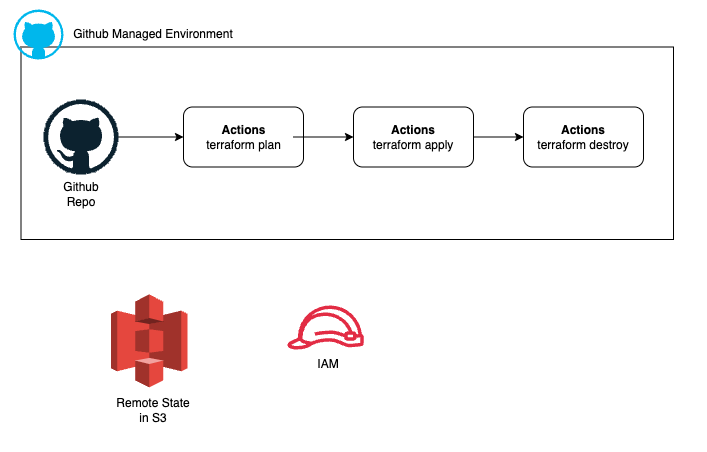

### Github Managed Environment

The diagram below represents a CI/CD workflow for managing infrastructure with Terraform on GitHub Actions, integrated with AWS resources.

### References

1. https://developer.hashicorp.com/terraform/tutorials/automation/github-actions

2. [Terraform CI/CD Pipeline using Github Actions](https://www.youtube.com/watch?v=Ah17o_1bryo)